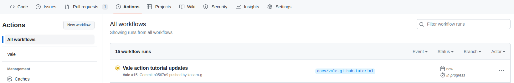
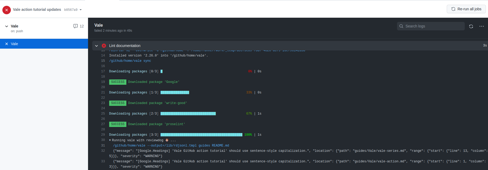
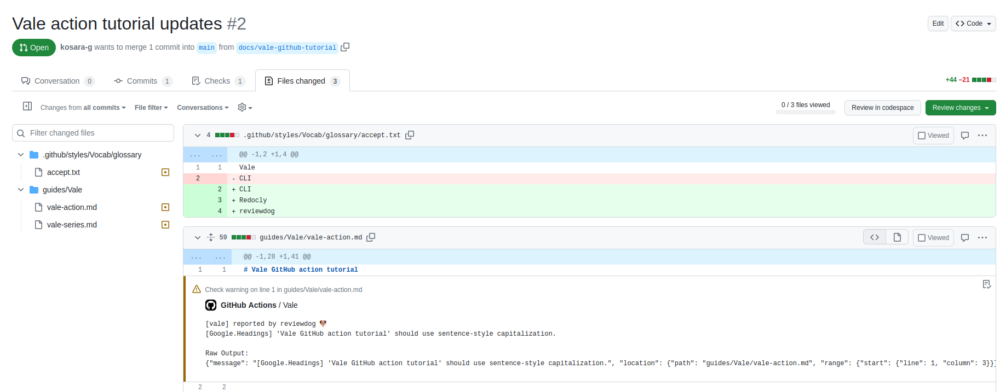

# Vale GitHub action tutorial

> :information_source: **Assumptions**:
>
> - youʼre already familiar with the basics of GitHub actions, otherwise, refer to the *Further reading* section
> - your GitHub repository has under 50 documentation files (in Markdown, plain text, or YAML)
> - you work with feature branches and do not push directly to the default branch

<!-- TOC depthfrom:2 -->

- [Scope of this tutorial](#scope-of-this-tutorial)
- [About the Vale GitHub action](#about-the-vale-github-action)
- [Set up the workflow](#set-up-the-workflow)
    - [Target project structure](#target-project-structure)
    - [Create your Vale configuration](#create-your-vale-configuration)
    - [Create your workflow file](#create-your-workflow-file)
- [Test the workflow](#test-the-workflow)
- [Further reading](#further-reading)

<!-- /TOC -->

---

## Scope of this tutorial

This overview shows you how to set up, configure, and view the results of the Vale GitHub action.

## About the Vale GitHub action

Linting your documentation in a continuous integration pipeline saves you the manual effort of running the linter from the command line. Another benefit is that you don't have to worry about fetching the latest versions of the packages you're using with `vale sync` because the action downloads these versions by default every time it runs.

## Set up the workflow

To get started with the action, you need to create some Vale configuration files and the workflow file for GitHub.

### Target project structure

By following this tutorial, your repository should look have this directory structure at the end:

```
my-repo
├── ...
├── .github
│   ├── ...
│   ├── styles
│   │       └── Vocab
│   │           └── my-domain
│   │               ├── accept.txt
│   │               └── reject.txt
│   └── workflows
│       └── lint_docs.yml
├── .vale.ini
└── ...
```

The next sections show you how to achieve that.

### Create your Vale configuration

Create the file `.vale.ini` at the *root* of your project and paste the following configuration in the file:

```
StylesPath = .github/styles
MinAlertLevel = warning
Packages = Google, proselint, write-good
Vocab = glossary
[*.md]
BasedOnStyles = Vale, Google, proselint, write-good
```

For a detailed breakdown of the different settings, see my [Vale CLI guide](./vale-cli.md).

Note that `Vocab` points to an optional directory where add terms that Vale should always ignore or flag, respectively.

You should see a hidden directory `.github` at the root of your project, if not, create it. In that directory create the following nested directory structure: `/styles/Vocab/glossary`.

Create two files in `/glossary`: `accept.txt` for terms to ignore and `reject.txt` for terms to flag. You don't have to include any terms in these files for now.

Note that you can either add exact terms or use regular expressions in the vocabulary files. For more information, see the [Vale documentation](https://vale.sh/docs/topics/vocab/).

### Create your workflow file

In `.github`, create the directory `/workflows` if it doesnʼt already exist.

Create the workflow file, for example, `vale-linter.yml`, under `/.github/workflows` with the following content:

```yml
name: Vale
# Run this job whenever a Markdown file is changed
on:
  push:
    paths:
      - '**.md'
jobs:
  Vale:
    runs-on: ubuntu-latest
    steps:
      - name: Checkout branch
        uses: actions/checkout@v3
      - name: Lint documentation
        uses: errata-ai/vale-action@reviewdog
        with:
          # Report results for every PR and push
          reporter: github-check
```

## Test the workflow

Push your changes to a feature branch and create a pull request. You should see the workflow run under the *Actions* tab with the name you set in the workflow file, in this case, *Vale*.



Open the latest run in the list or see the *Checks* tab in your pull request to view the full logs.



You can expand the collapsed steps in the log to see the raw output from the linter.

The action also invokes [reviewdog](https://github.com/reviewdog/reviewdog#readme), which reports the results as [annotations](https://github.blog/2018-12-14-introducing-check-runs-and-annotations/) in GitHubʼs UI.

You can view the annotations in the *Files changed* tab in your pull request.



---

## Further reading

If you're new to GitHub actions, you can learn the basics in [this overview of using workflows](https://docs.github.com/en/actions/using-workflows/about-workflows).

You can read more about the Vale action in the [official documentation on GitHub](https://github.com/errata-ai/vale-action).

If your repository contains a lot of documentation files, you should consider [running the workflow on the changed files](https://github.com/tj-actions/changed-files#usage).
