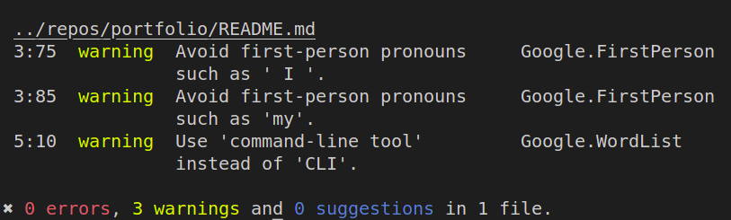

# Vale CLI tutorial

> :information_source: **Before you begin**: this tutorial assumes you're using *macOS*.

## About Vale CLI

Vale is a linter for text (prose) that can help you identify issues with spelling,punctuation, wording, style, and more. You can apply off-the-shelf linting rules or customize them and set the severity levels (`error`, `warning`, or `suggestion`).

The Vale CLI is a command-line interface that allows you to run Vale on your local machine.

## Installation

The recommended method for installing Vale is through a package manager, in this case, [Homebrew](https://formulae.brew.sh/formula/vale).

1. Open the Terminal app.
2. Run this command in the terminal:

    ```sh
    $ brew install vale
    ```

3. Verify that Vale is installed by running this command:
    
    ```sh
    $ vale --version
    ```

You should now see the currently instaled version.

You can find the complete instructions in the [official Vale documentation](https://vale.sh/docs/vale-cli/installation/).

### Set up Vale

> :information_source: **Scope of this tutorial**: the instructions cover the default Vale style and the Google style. Feel free to try it out with other styles.

1. You need to create the project structure for the Vale configuration files. In this example, the top-level directory is named `/vale`.

    ```sh
    $ mkdir vale && cd vale
    $ mkdir styles
    $ touch .vale.ini
    ```

    The `/styles` directory is where you store the different rule packages (or *styles*). Packages are Vale-compatible implementations of style guides hosted on [Valeʼs Package Hub](https://vale.sh/hub/).

    The default style is **Vale**. `.vale.ini` is the configuration file, where you configure which styles and which severity settings you want to apply.

2. Add your configuration to the `.vale.ini` file. You can use the [Vale config generator](https://vale.sh/generator) to pre-fill the file for you.

    ```
    StylesPath = styles
    Packages = Google
    MinAlertLevel = suggestion
    [*.md]
    BasedOnStyles = Vale, Google
    ```

    `StylesPath` sets the directory where Vale can find any additional packages. In this example, that's the `/styles/` directory.

    `MinAlertLevel` determines which issues are reported based on their severity (errors, warnings, and suggestions). Setting this parameter to `suggestion` means that **all** issues are reported, down to the suggestions. To exclusively see the errors, you can set it to `error`.

    The `[*.md]` parameter determines which files to lint, in this example, all Markdown files. To lint any filetype, use `[*]` instead.

    `BasedOnStyles` determines the styles to apply. In this case, the default Vale rules and the [Google style guide](https://developers.google.com/style).

3. Download the list of packages you specified in `Packages`. Run this command in the terminal

    ```sh
    $ vale sync
    ```

    You need to do this once during setup and anytime there is a new package release.

    Once the Package has been downloaded to your `StylesPath` directory, your project structure should look like this:

    ```
    vale
    ├── .vale.ini
    └── styles
        └── Google
    ```

### Run Vale

You can lint single files or entire directories. You **must** run Vale from the **same** directory as your `.vale.ini` configuration file.

To lint a README file in another directory, you can run Vale like this:

```sh
$ cd vale
$ vale ../repos/portfolio/README.md
```

The output from the linter includes which package found the issue, which line and character position you should look at, and how to fix it. See an example of what the Vale issue report looks like below.


